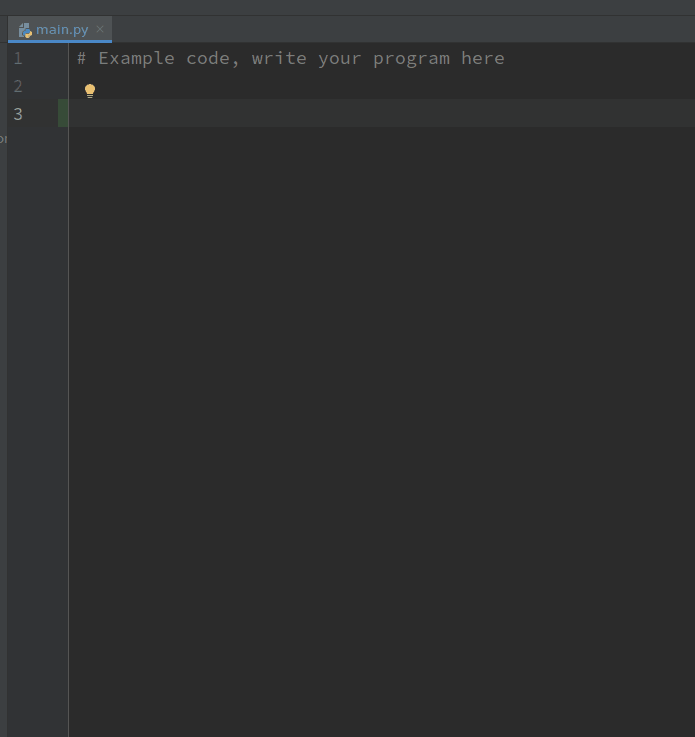
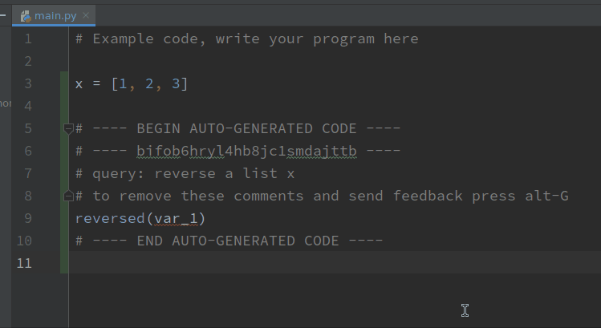
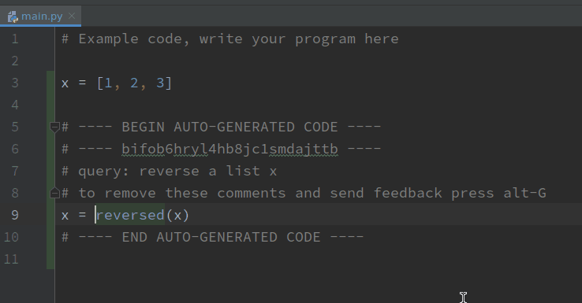

# tranX-plugin
A plugin for code generation in PyCharm/IntelliJ using tranX

## Development
- Clone this repository
- Open IntelliJ IDEA IDE software, File - Open, select the repo directory.
- The IDE will automatically identify this as a Gradle project (through **build.gradle** file, see https://github.com/JetBrains/gradle-intellij-plugin/). Please enable Gradle auto-reimport if prompted so that modifications to **build.gradle** file will be automatically updated.
- To test run the plugin in a sandboxed PyCharm IDE instance, open "Gradle" panel on the right side of the IDE. Find "Tasks - intellij - runIde" and double click to run it.
- To build and package the plugin into a jar, use "Tasks - intellij - buildPlugin" instead.

## Installation
- Download the latest release tranx_plugin-SNAPSHOT.zip
 from https://github.com/neulab/tranX-plugin/releases
- Follow the instruction on https://www.jetbrains.com/help/idea/managing-plugins.html#install_plugin_from_disk to install plugin zip file to PyCharm IDE (version 2019.1 or higher)

## Usage

### Quick Start
- Create a new Python project and in the editor, press Alt-Ctrl-G (Control+Options+G for Mac) or click "Ask question" in the right click context menu.
- After editing the code snippet, make sure the cursor is currently within to range of the auto-generated code block. Press Alt-G (Options+G for Mac) to upload edits.

### How to perform a query to generate and retrieve code snippets?
- In the code editor area, either click through the context menu `Ask question`, or use shortcut `Control+Options+G` for Mac users and `Ctrl+Alt+G` for Windows/Linux users.
- This will brought up dialog where you can enter your intent in natural language for both generation and retrieval of code snippets. You press `Enter` to fire the query.
- The candidate code snippets will be shown in a list. There are two types of results. The first several snippets with a "i" icon are generated by our state-of-the-art natural language to code generation model, while the latter ones with the icon of "internet" are retrieved top answer snippets on StackOverflow.
- You can select the desired output by pressing `Enter` on the candidate. Or, you could click the blank area of the editor or press `Esc` to give up.

### How to write your queries that best suit the code generation model?
- Quote variable names in the query with grave accent mark: ``... `variable_name` ...``.
- Quote string literals with regular quotation marks: ``... "Hello World!" ...``
- Example query 1: open a file "yourfile.txt" in write mode.
- Example query 2: lower a string `` `text` `` and remove non-alphanumeric characters aside from space.

### How to edit generated code snippets to fit your programming need?
- It is often the case that the generated or retrieved code snippets need more editing to fit the program.
- To do so, simply edit as usual inside the auto-generated code block. 
- Make sure to NOT edit any of the automatically generated comment lines, as they are crucial for data collection purposes. You can see what your query is in the comment block.
- NOTE: You should only edit the code snippet to make it perform exactly what your queried intent does. No more, no less.

### How to upload edited code snippets?
- After you are confident about your edits that does what your natural language intent query would do in the program, you should upload your edit to the server.
- To do so, put the caret inside the auto-generated block that you finished editing, then either click through the context menu `Upload edits`, or use shortcut `Options+G` for Mac users and `Alt+G` for Windows/Linux users.
- If successful, the auto-generated comment blocks will disappear and your edited code snippets are intact.

